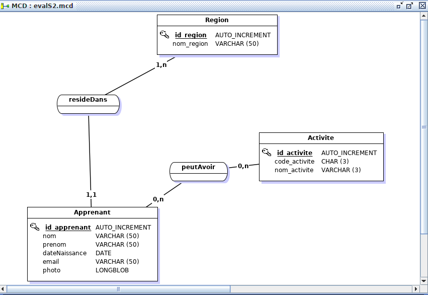
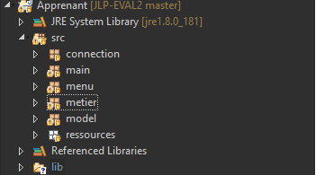

# Présentation du projet d'évalution MCD/MySQL/JDBC
## Introduction :
* Ce projet réalisé en binôme a pour but la validation des concepts relatifs à : 
* la modélisation en Merise/UML
* Le développement sous Eclipse des classes Java

## Visualisation du MCD

## Visualisation des packages du projet

## Outils utilisés
* Le modèle conceptuel de données a été réalisé avec MERISE JFREE SOFT, générant les modèles logique et physiques de données
* La base de données est implémentée sous MySQL en mode Workbench
* Les différentes fonctionnalités du projet ont été développées et testées avec Eclipse
      
